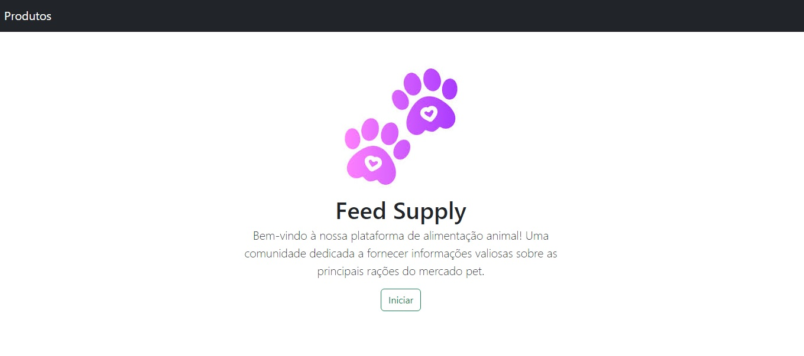

<H3>Desafio de projeto: Desenvolver uma aplicação em Flask usando FastAPI para construir aplicação em python </H3>
Professores: Rafael Galleani e Diego Rennan.

**Objetivo:**
Desenvolver em Flask uma página web onde o usuário possa interagir com a  aplicação; utilizando
FastAPI para construir uma API em python para armazenar uma lista de produtos.

**Nome da aplicação: Feed Supplay**

**Funcionalidades:** O aplicativo deve permitir que os usuários se cadastrem, façam login, vejam a página
do usuário, cadastrem produtos e vejam a página de produtos atualizada.

**Sobre o que é aplicação?**

É uma página web onde o usuário insere informações sobre marcas de rações. As informações estão focadas em
**Tipo de ração**  (Especial, premium ou super premium), 
**Nome** (marca da ração), 
**conservantes** (se sim, não, ou não foi especificado pelo fabricante), 
**transgênico** (se a embalagem contem a informação), 
**aditivos químicos** (Os aditivos químicos sintéticos presente na fórmula), 
**Organismo Geneticamente Modificado** (presentes na fórmula). 

Todas as informações podem ser encontradas nas embalagens e nos sites oficiais do produto.

**O que realizamos:**

Nesse projeto em flask, o FastAPI cria uma API RESTful que permite inserir produtos em uma lista.
O que significa que é possível enviar solicitações HTTP para a API com dados de produto e a 
API os adicionará a lista de produto. Permitindo que outros aplicativos ou serviços acessem e 
manipulem os dados da lista.

**E ainda:**
- Estudamos sobre definição de rotas, funções e templates, lógica de negócio, validação de dados de entrada.
- Estudamos sobre Flask-Migrate para  gestão da estrutura do banco de dados.
- SQLAlchemy para manipulação e operações no BD. O SQLAlchemy é acamada de ORM utilizada pelo Flask para interagir com
o banco de dados.

**Funcionalidades que pretendemos melhorar:**

- Incluir uma ferramenta para documentar a API;
- Adicionar Edição e exclusão de produtos;
- Melhorias na interface do usuário;
- Implementação de sessões de usuário para manter o login persistente;
- Logout de Usuário
- Melhorias na segurança, como proteção contra CSRF;
- Implementação de funcionalidades adicionais para a página do usuário, como 
visualização de dados específicos do usuário e os produtos que ele adicionou.

Mais informações na documentação da aplicação.

